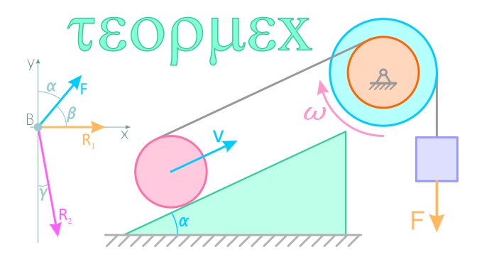

# ТЕОРЕТИЧЕСКАЯ МЕХАНИКА
Теоретическая механика (сокр. — теормех, термех) — наука, изучающая общие законы движения, равновесия и механических взаимодействий между материальными телами.

### [Раздел 1 **Теоретическая механика лекция №1**](/Теоретическая%20механика/Теоретическая%20механика%20лекция%20№1.md)

### [Раздел 2 **Угловая скорость и угловое ускорение**](/Теоретическая%20механика/Угловая%20скорость%20и%20угловое%20ускорение%20.md)

1. [Угловая скорость](/Теоретическая%20механика/УГЛОВАЯ%20СКОРОСТЬ.md)

### [Раздел 3 **Ускорение Кориолиса**](/Теоретическая%20механика/УСКОРЕНИЕ%20КОРИОЛИСА.md)

### [Раздел 3 **Второй закон Ньютона**](/Теоретическая%20механика/ВТОРОЙ%20ЗАКОН%20НЬЮТОНА.md)
