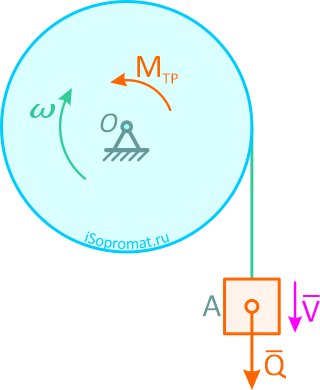

> «Изменение количества движения пропорционально приложенной силе и происходит в направлении силы».

Это главный закон Ньютона, на котором основаны практически все расчеты в инерционной механике и который определяет взаимосвязь между массой тела, его ускорением и силами, действующими на это тело.

## Связь силы, массы и ускорения тела

Как следует из закона инерции, ускорение материальной точки равно нулю, если точка изолирована от действия сил. Если же к точке приложена некоторая сила, то эта точка отклоняется от инерционного движения, приобретая некоторое ускорение.

Опыт показывает, что одна и та же сила сообщает двум различным покоящимся материальным точкам неодинаковые ускорения.

При действии одинаковых сил модуль ускорения одной материальной точки может оказаться меньшим, чем модуль ускорения другой точки. В этом случае говорят, что первая точка является более инертной, и наоборот. Отсюда следует, что _инертность выражает свойство материальной точки под действием силы приобретать в своем движении то или иное ускорение_.

Таким образом, ускорения, приобретаемые двумя различными материальными точками, зависят не только от действующих на них сил, но и от инертности этих точек.

Величина, определяющая меру инертности данной материальной точки, называется массой точки. Масса является величиной скалярной, положительной, и при этом в классической механике она рассматривается как величина постоянная для каждой данной материальной точки.

Масса является единственной характеристикой материальной точки. Отличие материальных точек друг от друга сводится к различию в массах.

Связь между массой **_m_** материальной точки, силой **_F_**, приложенной к этой точке, и сообщаемым ею ускорением **_a_** устанавливается вторым законом динамики. Приведем этот закон в следующей формулировке:

_Ускорение материальной точки относительно инерциальной системы отсчета пропорционально действующей на точку силе, направлено по этой силе и обратно пропорционально массе точки_, т.е.

$$\vec{F}=m\vec{a} $$

Следует заметить, что из формулировки второго закона динамики не вытекает, что в динамике исследуются движения, происходящие только в инерциальных системах отсчета. В динамике рассматривается движение и в неинерциальных системах, но только таких, движение которых задано относительно инерциальной системы отсчета.

Приведем здесь еще одну формулировку второго закона Ньютона, в современной трактовке:

_Равнодействующая всех сил, приложенных к телу, равна произведению массы этого тела на его ускорение, под действием этих сил.

# АЛГОРИТМЫ РЕШЕНИЙ ЗАДАЧ ДИНАМИКИ

Алгоритмы решений задач по разделу «Динамика» технической, инженерной и теоретической механики.

Последовательность решения задач на расчет скоростей, ускорений и других параметров точек, твердых тел и механических систем при их движении с учетом заданных сил.
## Определение угловой скорости шкива

Задача

На цилиндрический шкив весом P=25Н и радиусом r=20см намотана нить с подвешенным на конце грузом A весом Q=18Н.

Пренебрегая весом нити, определить угловое ускорение шкива при вертикальном перемещении груза, если радиус инерции шкива относительно его оси O равен ρ=5см и на шкив, в месте его крепления, действует постоянный момент сил трения Mтр=6Нм.

Решение

Рассмотрим систему шкив-груз, тогда неизвестные силы натяжения нити будут внутренними усилиями.

Воспользуемся теоремой моментов относительно оси O

$$\frac{\mathrm{dK_{0}} }{\mathrm{d} x}= \sum m_{0}(\bar{F}{_{k}}^{e})$$

Для заданной системы
Груз движется поступательно и его скорость равна

$$\nu =\omega\cdot r$$

Шкив вращается вокруг неподвижной оси O и для него

$$J_{0}= (\frac{P}{g})\rho ^{2}$$

Тогда ля моментов сил получаем

$$\tfrac{Qr^{2}+P\rho ^{2}}{g}\frac{d\omega }{dt}=Qr - M_{_{nh}}$$

Откуда, подставив значения, определяем величину искомого углового ускорения шкива

$$\varepsilon =\frac{(Qr-M_{Tp})g}{Qr^{2}+P\rho ^{2}}$$

$$\varepsilon =\frac{(18\cdot 0.2-3)g}{18\cdot 0.2^{2}+25\cdot 0.05 ^{2}}=7.52$$

Задача решена.
