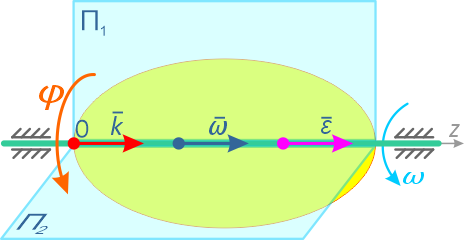

Рассмотрим понятия _угловой скорости и углового ускорения_ при вращении твердого тела в теории и на примерах решения задач.

## Угловая скорость

Угловой скоростью называют скорость вращения тела, определяющуюся приращением угла поворота тела за некоторый промежуток (единицу) времени.

Данный параметр показывает, на какой угол (например, в радианах) поворачивается тело за единицу времени (например, за 1 секунду).

Обозначение угловой скорости: $\omega$ 
Единицы измерения: [рад/с], [c-1].

Рассмотрим некоторое твердое тело, вращающееся относительно неподвижной оси.

С этим телом свяжем воображаемую плоскость П, которая совершает вращение вместе с заданным телом.

Вращательное движение определяется двугранным углом $\varphi$ между двумя плоскостями, проходящими через ось вращения. Изменение этого угла с течением времени есть закон вращательного движения: 

$$\varphi  = \varphi(t)$$

Положительным считается угол, откладываемый против хода часовой стрелки, если смотреть навстречу выбранному направлению оси вращения Oz. Угол измеряется в радианах.
Быстрота изменения угла φ (перемещения плоскости П из положения П1 в положение П2) – это и есть угловая скорость:

$$\omega = \frac{d\varphi }{dt}=\dot{\varphi}$$

Приняв вектор _k_ как единичный орт положительного направления оси, получим:

$$\bar{\omega }=\bar{k} \dot{\varphi}=\bar{k}\frac{d\varphi }{dt}$$

Вектор угловой скорости – скользящий вектор: он может быть приложен к любой точке оси вращения и всегда направлен вдоль оси, при положительном значении угловой скорости направления _ω_ и _k_ совпадают, при отрицательном – противоположны.

### Определение угловой скорости

_Пример:_ Диск вращается относительно своего центра.

Известна скорость v некоторой точки A, расположенной на расстоянии r от центра вращения диска.

Определить величину и направление угловой скорости диска $\omega$ , если v = 5 м/с, r = 70 см.

$$\omega = \frac{\nu_{A}}{r}=\frac{5}{0,7}=7,14 c^{-4}$$

Таким образом, угловая скорость диска составляет 7,14 оборотов в секунду. Направление угловой скорости можно определить по направлению скоростей её точек.

Вектор скорости точки A стремится повернуть диск относительно центра вращения против хода часовой стрелки, следовательно, направление угловой скорости вращения диска имеет такое же направление.
