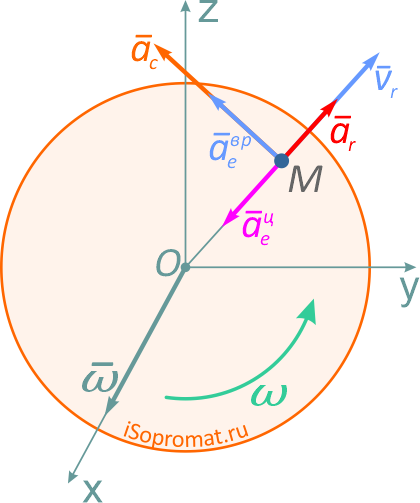
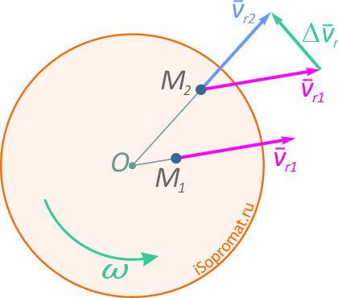
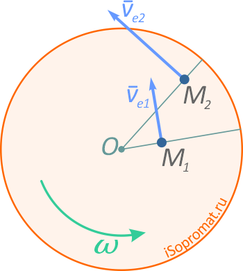

_Ускорение Кориолиса_ (_Кориолисово ускорение_) характеризует изменение относительной скорости по направлению за счет переносного вращения и изменение величины переносной скорости за счет относительного движения.

Согласно _теореме Кориолиса_, абсолютное _ускорение_ точки в сложном движении определяется как геометрическая сумма относительного, переносного и кориолисова ускорений (рис. 3)

$$\vec{a_{a}}=\vec{a_{r}}+\vec{a_{e}}+\vec{a_{c}}$$

Рис. 3

Поскольку, в данном случае, относительное движение происходит по прямой линии, относительное ускорение **ar** направлено вдоль этой прямой и определяется выражением
$$a_{r}=\frac{\mathrm{d^{2}OM} }{\mathrm{d} t^{2}}$$
Переносным ускорением точки **M** является ускорение точки **M** диска. Диск совершает вращательное движение, следовательно, переносное ускорение определяется выражение

$$\vec a_{e}=\vec a_{e}^{Bp}+\vec a_{e}^{uc}$$

где $\vec a_{e}^{Bp}= \varepsilon \cdot OM$ — вращательное ускорение точки **M**, направленное перпендикулярно отрезку **OM**;
$\vec a_{e}^{uc}= \omega \cdot OM$ — центростремительное ускорение точки **M**, направленное к центру диска.

_Ускорение Кориолиса_ или поворотное ускорение определяется по формуле
$$\vec a_{c}= 2 \vec \omega _{e}\times \vec \nu _{r}$$
где $\omega _{e}$  — переносная угловая скорость, $\nu _{r}$ — относительная скорость точки.

Направление Кориолисова ускорения определяется по правилу векторного произведения или по правилу Жуковского.

Величина ускорения Кориолиса определяется выражением
$$a_{c}=2\omega _{e}\cdot \nu _{r}\cdot sin\alpha $$
где $\alpha$ – угол между векторами $\omega _{e}$ и $\nu _{r}$

Рассмотрим, какой физический смысл заложен в ускорение Кориолиса. Для простоты будем считать, что диск вращается с постоянной угловой скоростью, а точка **M** движется относительно диска с постоянной относительной скоростью (рис.4).

Рис. 4

Пусть в момент времени **t1** точка **M** занимала положение **M1** и имела относительную скорость **νr1**. За промежуток времени **Δt** точка **M** переместится в положение **M2**, при этом направление скорости **νr** изменится вследствие вращения диска. Вектор **νr** получит приращение **Δνr**.

Отношение

$$\frac{\Delta \vec \nu_{r}}{\Delta t}$$

определяет среднее ускорение точки за промежуток времени **Δt**. Предел отношения

$$\frac{\Delta \vec \nu_{r}}{\Delta t}$$

при **Δt→ 0** есть производная

$$\frac{\Delta \vec \nu_{r}}{\Delta t}$$

как производная от вектора постоянного по величине.

Рассмотрим, как изменяется переносная скорость в зависимости от относительного движения. В моменты времени **t1** и **t2** переносная скорость определяется выражениями

$$ \Delta \vec \nu_{e}=\vec \omega \times\overrightarrow{OM}_{2} - \vec \omega \times \overrightarrow{OM}_{1} = \vec \omega \times (\overrightarrow{OM}_{2}-\overrightarrow{OM}_{1})= \vec \omega \times \vec \nu _{r}\cdot \Delta t $$

Отношение

$$\frac{\Delta \vec \nu_{e}}{\Delta t}$$

в пределе при **Δt→ 0** дает производную

$$\frac{\mathrm{d} \vec \nu_{e}}{\mathrm{d} t}= \vec \omega \times \vec \nu_{r}$$

Таким образом, ускорение Кориолиса с одной стороны характеризует изменение относительной скорости по направлению за счет переносного вращения и, с другой стороны, изменение величины переносной скорости за счет относительного движения.

Рис. 5
